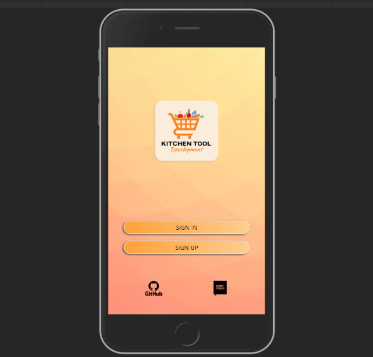

# <h1>**KitchenTool**</h1>

Adaptación de la App LabTool para la gestión de compras en el supermercado.
 
 

## **Adaptación**

- Se han adapatado los tipos de productos en la base de datos al ámbito de productos de supermercado.
 

- Al agregar productos a la base de datos se debe seleccionar el tipo de producto según la lista desplegable de tipos en vez de asignarse por defecto "añadidos".
 

- La búsqueda avanzada de productos en la base de datos se puede realizar mediante nombre o casa comercial.
 

- Se ha añadido búsqueda de productos en el Stock disponible del hogar y filtrado del stock según el estado ("In stock" / "Out of stock") y "actualmente solicitados".
 
 
 

## **Tecnologías usadas**

- `HTML5`
- `CSS3`
- `JavaScript`
- `Node.JS v14.16.0.`
- `MongoDB`
 
 

## **Dependencias**

- `react: ^17.0.2`
- `react-dom: ^17.0.2`
- `react-scripts: 4.0.1`
- `express: ^4.17.1`
- `mongoose: ^5.11.18`
- `axios: ^0.21.1`
- `nodemon: ^2.0.7`
- `bcrypt: ^5.0.1`
- `jsonwebtoken: ^8.5.1`
- `dotenv: ^8.2.0`
- `validator: ^13.5.2`
- `concurrently: ^6.0.0`
- `web-vitals: ^1.1.1`
 
 

