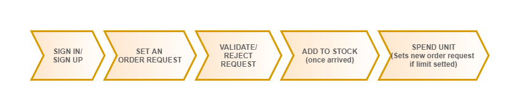
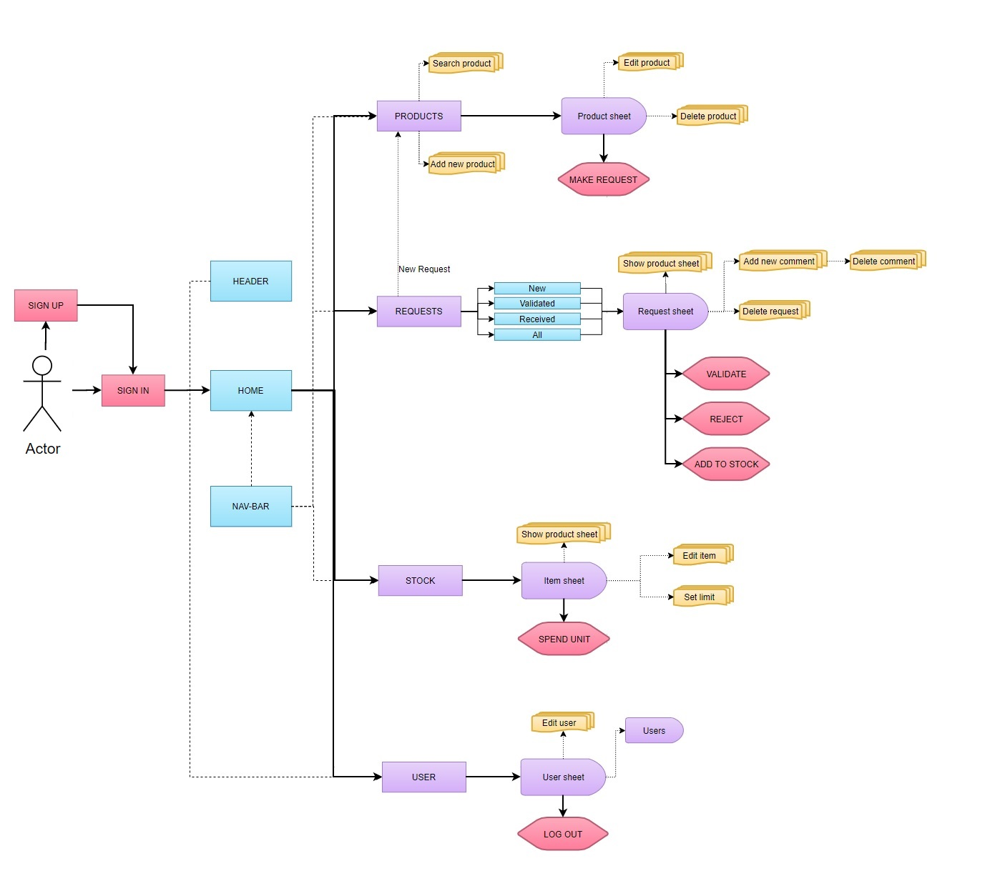
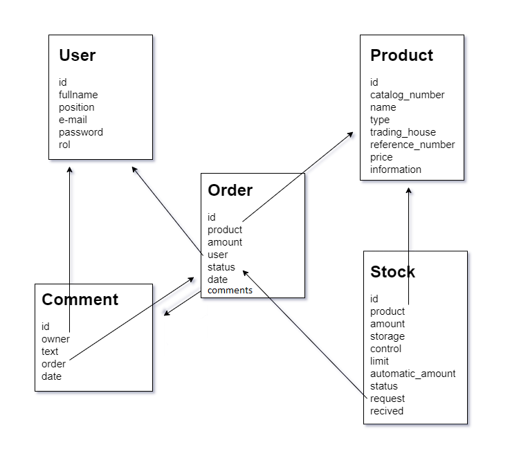

# <h1>**KitchenTool**</h1>


Adaptación de la App LabTool para la gestión de compras en el supermercado.
<br>
<br>
**Puedes acceder a la aplicación a través de este enlace [LabTool development](https://labtooldevelopment.herokuapp.com/)**
<br>
<br>


## **Descripción funcional**

LabTool permite llevar un control de las solicitudes de pedidos realizadas y, mediante la validación del pedido por parte del usuario registrado como validador, autorizar la compra sólo a las solicitudes permitidas. LabTool también permite llevar un control del stock disponible en cada momento proporcionando información útil y actualizada del estado en que se encuentra cada producto para una mayor eficacia en su control. Las distintas funcionalidades que dispone la aplicación se detallan a contiuación:

### **SECCIÓN DE REGISTRO**
-**Registro** de los usuarios que harán uso de la aplicación y adquisición del rol **"validador"** o **"usuario"** dependiendo de si tendrá permisos de validador de solicitudes.

-**Inicio de sesión** de los usuarios registrados.
<br>
<br>

### **SECCIÓN DE PRODUCTOS**
-**Visualización de una base de datos donde se recogen todos los productos** disponibles para solicitar su compra con información sobre el número de catálogo, tipo, casa comercial, número de referencia, precio e información del producto. En este caso práctico, se trata de los productos ofertados por el servicio de suministros generales a los laboratorios en un centro de investigación. 

**Filtrar** la lista de productos según el tipo o realizar una búsqueda por nombre, número de catálogo o número de referencia.

**Agregar nuevos productos** que son ofertados por otra fuente y que son requeridos por el laboratorio mediante un formulario de registro.

**Visualizar la ficha del producto**  con su información:
<br>Número de catálogo
<br>Tipo
<br>Casa comercial
<br>Número de referencia
<br>Precio
<br>Información del producto
Además es posible modificar el campo de información del producto o eliminarlo de la base de datos.

-**Solicitud de compra** de un producto de la base de datos especificando la cantidad mediante el formulario de soliciud. 

-**Establecer o modificar información del producto**

-**Eliminar el producto de la base de datos** mediante previa confirmación.
<br>
<br>

### **SECCIÓN DE PEDIDOS**
Las solicitudes de compra podrán encontrarse en cuatros estados posibles;
* **En espera:** La solicitudes recién creadas se encuentran en estado de espera hasta ser revisadas y validadas por el usuario responsable.
* **Validada:** La solicitud ha sido validada por el usario responsable y es posible proceder a su compra.
* **Rechazada:** La solicitud ha sido rechazada por el usuario responsable.
* **Recibida:** La solicitud validada ha sido pedida y ha llegado a su destino.

-**Visualizar las listas de pedidos** según su estado con información relevante como la cantidad solicitada, nombre de la persona solicitante, fecha de solicitud y número de mensajes que contiene.
A demás dispone de un enlace rápido a la sección de productos para realizar una nueva solicitud.

-**Visualizar la ficha del pedido** con su información:
<br>Nombre de producto 
<br>Cantidad solicitada 
<br>Persona solicitante
<br>Fecha de solicitud
<br>Estado
<br>Comentarios que contiene.

-**Visualizar la ficha del producto** relacionado con el pedido.

-**Añadir y eliminar comentarios del pedido** mostrando el nombre de la persona que realiza el comentario, la fecha de creación y el texto del mensaje.

-**Validación** de una solicitud de compra por parte del usuario resposable.

-**Rechazo** de una solicitud de compra por parte del usuario responsable.

-**Marcar como recibida** una solicitud y automáticamente actualizar el stock disponible.

-**Eliminar la solicitud de pedido** en cualquiera de sus estados mediante previa confirmación.
<br>
<br>

### **SECCIÓN DE STOCK**
-**Visualización de la lista de stock** disponible con información útil del estado de cada artículo (nombre del producto, en stock o fuera de stock, control de límite activado, actualmente pedido y unidades en stock).

-**Visualización de la ficha del ítem del stock** con su información:
<br>Nombre del producto.
<br>Cantidad de unidades en stock.
<br>Lugar de almacenamiento.
<br>Conocer si tiene control de límite activado y de ser así, la cantidad límite y unidades a pedir automáticamente.
<br>Conocer si se encuentra actualmente pedido.
<br>Fecha de llegada de la última reposición.

-**Visualización de la ficha del producto** relacionado con el ítem.
 
 -**Reducir una unidad del stock** cada vez que se consume un producto.

-**Modificar información del ítem** como la cantidad en stock y el lugar de almacenamiento.

-**Establecer un límite** inferior de unidades en stock por el cual realizar una solicitud de pedido automática y de una cantidad determinada en caso de que el stock alcance dicho límite. La solicitud creada dispondrá de un mensaje donde especifica que fué creada automáticamente.

-**Eliminar el ítem del stock** mediante previa confirmación.
<br>
<br>

### **SECCIÓN DE USUARIO**
-**Visualización de la información del usuario logueado** (Nombre, email, posición laboral y rol).

-**Modificar información del usuario** (Nombre y posición laboral).

-**Cerrar sesión**

-**Visualizar una lista y ficha de los demás usuarios registrados** con información sobre su email, posición laboral y rol.

-**Eliminar cuenta de usuario** mediante previa confirmación.
<br>
<br>
<br>

## **Esquema de flujo**

<br>
<br>

## **Esquema de uso**

<br>
<br>
<br>
### <h1>**BACKEND**</h1>
Basado en Node.JS.<br>
Base de datos alojada en `MongoAtlas`. Llamadas a la BD y modelo de datos a través de `Mongoose`.<br>
Encriptamiento de datos (password) y protección de rutas privadas con `bcrypt` y `jsonwebtoken`.<br>
Direccionamiento con `Express`.<br>
<br>
<br>

## **Esquema de relaciones**


<br>
<br>

## **Direccionamiento:**
<br>

**Usuario:**
<br>

```
get user/ 
```
^ Ruta privada que devuelve todos los documentos de usuarios registrados.
<br>
<br>

```
post user/newuser 
```
^ Ruta pública que permite el regístro de usuarios con los parámetros validados de fullname(string), position(string), email(email-string), password(string) y rol("user"/"validator"). 
<br>Devuelve el documento creado.
<br>
<br>

```
delete user/deleteuser 
```
^ Ruta privada que elimina el documento del usuario logueado de la base de datos. 
<br>Devuelve un mensaje de confirmación.
<br>
<br>

```
put user/modify 
```
^ Ruta privada que permite modificar los parámetros de "fullname" y "position" en el documento del usuario logueado. 
<br>Devuelve un mensaje de confirmación.
<br>
<br>

```
get user/id(usuario)
```
^ Ruta privada que requiere del id del usuario. Devuelve un usuario concreto por su id.
<br>
<br>
<br>

**Producto:**
<br>

```
get product/ 
```
^ Ruta privada que devuelve los productos disponibles en la base de datos.
<br>
<br>

```
post product/newproduct 
```
^ Ruta privada que permite añadir un nuevo producto a la base de datos con los parámetros validados de catalog_number(number), name(string), type(string), trading_house(string), reference_number(string), price(number), information(string). 
<br>Devuelve el documento creado.
<br>
<br>

```
delete product/deleteproduct/id(producto) 
```
^ Ruta privada que requiere del id del producto a eliminar. Elimina el producto de la base de datos y devuele un mensaje de confirmación.
<br>
<br>

```
put product/id(producto)/modify 
```
^ Ruta privada que requiere del id del producto a modificar. Modifica o establece información sobre el producto.
<br>
<br>

```
get product/id(producto)
```
^ Ruta privada que requiere del id del producto. Devuelve un producto concreto por su id.
<br>
<br>
<br>

**Pedido:**
<br>

```
get order/ 
```
^ Ruta privada que devuelve todos los pedidos de la base de datos independientemente de su estado.
<br>
<br>

```
post order/neworder/id(producto) 
```
^ Ruta privada que requiere del id del producto a pedir (en la ruta) y de la cantidad (amount). Crea un documento de pedido con los parámetros validados de product(ObjectId), amount(number), user(ObjectId), status("waiting", por defecto) y date(date). 
<br>Al crear el documento se cambia el párametro "request" a "true" en el documento de este producto en el stock (si es que lo hubiera). 
<br>Devuelve el documento creado.
<br>
<br>

```
put order/validate/id(pedido) 
```
^ Ruta privada que requiere del id del pedido a validar (en la ruta). 
<br>Comprueba que el usuario logueado disponga de rol "validator" y si es así modifica el parámetro "status" a "validated" en el documento del pedido. 
<br>Devuelve un mensaje de confirmación.
<br>
<br>

```
put order/reject/id(pedido) 
```
^ Ruta privada que requiere del id del pedido a rechazar (en la ruta). 
<br>Comprueba que el usuario logueado disponga de rol "validator" y si es así modifica el parámetro "status" a "rejected" en el documento del pedido. 
<br>Devuelve un mensaje de confirmación.
<br>
<br>

```
delete order/deleteorder/id(pedido) 
```
^ Ruta privada que requiere del id del pedido a eliminar (en la ruta). 
<br>Elimina el documento del pedido en la base de datos y devuelve un mensaje de confirmación.
<br>
<br>

```
get order/waiting 
```
^ Ruta privada que devuelve los pedidos con status "waiting" a la espera de validación.
<br>
<br>

```
get /order/validated 
```
^ Ruta privada que devuelve los pedidos con status "validated".
<br>
<br>

```
get order/rejected 
```
^ Ruta privada que devuelve los pedidos con status "rejected".
<br>
<br>

```
get order/received 
```
^ Ruta privada que devuelve los pedidos con status "received".
<br>
<br>

```
get order/id(pedido)
```
^ Ruta privada que requiere del id del pedido. Devuelve un pedido concreto por su id.
<br>
<br>
<br>

**Comentarios:**
<br>

```
get comment/id(pedido) 
```
^ Ruta privada que requiere del id del pedido (en la ruta) para mostrar los comentarios asociados a ese pedido. Devuelve los documentos de comentarios de ese pedido.
<br>
<br>

```
post comment/newcomment/id(pedido) 
```
^ Ruta privada que requiere del id del pedido a comentar(en la ruta). 
<br>Crea un documento de comentario en la base de datos con los parámetros validados text(string), owner(ObjectId), order(ObjectId), date(date). 
<br>Devuelve el documento creado.
<br>
<br>

```
delete comment/deletecomment/id(comentario) 
```
^ Ruta privada que requiere del id del comentario a eliminar (en la ruta). 
<br>Comprueba que el comentario pertenece al usuario logueado y si es así lo elimina de la base de datos. 
<br>Devuelve un mensaje de confirmación.
<br>
<br>
<br>

**Stock:**
<br>

```
get stock/ 
```
^ Ruta privada que devuelve los ítems guardados en stock.
<br>
<br>

```
post stock/newitem/id(pedido) 
```
^ Ruta privada que requiere del id del pedido con status "validated" y que ya se disponga de él para añadirlo al stock. Si es la primera vez que el producto entra al stock se crea un nuevo documento en el que algunos parámetro se toman a partir de la información del pedido: product(ObjectId), amount(number), status("In stock"), request("false", por defecto), received(date) y storage(string). 
<br>En caso de ya estar registrado este producto en el stock se actualizarán los parámetros "amount", "status" y "received" en el documento ya existente. 
<br>Al mismo tiempo se modifica el status del pedido a "received" y también se comprueba si existen más pedidos en estado "waiting" o "validated" de ese mismo producto y, de ser así, establece el parámetro "request" del ítem en "true". 
<br>Devuelve el documento creado o un mensaje de confirmación de la actualización del ítem.
<br>
<br>

```
put stock/reduce/id(ítem) 
```
^ Ruta privada que reduce la cantidad del ítem en el stock en una unidad. En caso de alcanzar 0 unidades modifica el status del ítem a "Out of stock". 
<br>LÍMITE -> En caso de que el ítem tenga el parámetro "control" establecido en "true", la cantidad de ítem alcance el valor del parámetro "limit" y que no exista actualmente un pedido automático en estado "waiting" o "validated", se crea un nuevo pedido automático con la cantidad establecida en el parámero "automaticamount". 
<br>Al mismo tiempo modifica el parámetro "request" del ítem a "true". 
<br>Devuelve un mensaje de confirmación de cantidad reducida o cantidad reducida y pedido automático creado.
<br>
<br>

```
put stock/id(ítem)/modify 
```
^ Ruta privada que requiere del id del ítem a modificar (en la ruta). 
<br>Permite modificar los parámetros validados de amount(number), storage(string).
<br>En caso de no especificar alguno se mantendrá con el valor en el que se encontraban. 
<br>Devuelve un mensaje de confiración de la modificación.
<br>
<br>

```
put stock/id(ítem)/modify 
```
^ Ruta privada que requiere del id del ítem a modificar (en la ruta).<br>
Permite modificar los parámetros validados de limit(number), control(boolean), automaticamount(number) del ítem para establecer el control del límite de stock.
<br>
<br>
<br>

```
delete stock/deleteitem/id(ítem) 
```
^ Ruta privada que elimina el ítem de la base de datos. 
<br>Devuelve un mensaje de confirmación. 
<br>
<br>
<br>

```
get stock/id(ítem)
```
^ Ruta privada que requiere del id del ítem en stock. Devuelve un ítem concreto por su id.
<br>
<br>
<br>

**Login:**
<br>

```
post login/ 
```
^ Ruta pública que permite loguearse a través de los parámetros "email" y "password" del usuario. 
<br>En caso de confirmación devuelve un token válido por 24 horas con información del usuario ("id","fullname", "position" y "rol").
<br>
<br>
<br>

### <h1>**FRONTEND**</h1>
Basado en componentes `React`, `JSX`, `HTML5`.<br>
Renderizado con `React-dom`<br>
Llamadas ajax a la BD con `axios`.<br>
Enrutamiento a través del browser con `react-router-dom`.<br>
Estilo con `CSS3`.<br>

Funciona a través de dos roots en el index.html; uno para el renderizado general de los componentes de la app y otro para el renderizado de ventanas modales.
<br>

## **Componentes**

**Inicio:**
```
- register.
- signin.
- signup.
```
<br>

**Comunes:**
```
- header.
- navbar.
```
<br>

**Sección Home**
```
- home.
```
<br>

**Sección de productos**
```
- productSection.
- productListItem.
- productSheet.
```
<br>

**Sección de pedidos**
```
- requestSection.
- requestListItem.
- requestSheet.
```
<br>

**Sección de stock**
```
- stockSection.
- stockListItem.
- itemSheet.
```
<br>

 **Sección de usuario**
```
- user.
- userListItem.
- userSheet.
```
<br>

**Ventanas modales**
```
 - modal.
 - modalResponse + successResponse / errorResponse.
```
<br>

## **Servicios**

**apiURL**<br>
^ Permite cambiar el servidor para motivos de desarrollo o deploy.

**authToken**<br>
^ Incorpora o elimina en los headers de las llamadas ajax a la BD el token del usuario logueado para acceder a las rutas privadas.

**loadProductData**<br>
^ Carga en la BD los productos disponibles para su solicitud de compra.

**privateRoute**<br>
^ Redirecciona a 'signin' cuando no existe token de usuario logueado en localStorage.
<br>
<br>
<br>

## **Tecnologías usadas**

- `HTML5`
- `CSS3`
- `JavaScript`
- `Node.JS v14.16.0.`
- `MongoDB`
<br>
<br>

## **Dependencias**

- `react: ^17.0.2`
- `react-dom: ^17.0.2`
- `react-scripts: 4.0.1`
- `express: ^4.17.1`
- `mongoose: ^5.11.18`
- `axios: ^0.21.1`
- `nodemon: ^2.0.7`
- `bcrypt: ^5.0.1`
- `jsonwebtoken: ^8.5.1`
- `dotenv: ^8.2.0`
- `validator: ^13.5.2`
- `concurrently: ^6.0.0`
- `web-vitals: ^1.1.1`
<br>
<br>

## **TO DO**

- Implementar sólo un usuario validador o administrador que pueda establecer el rol de validador a otro usuario en vez de establecerse el rol al hacer el registro.
- Si se crea un pedido nuevo y ya hay uno en estado "waiting" preguntar y sumar las cantidad en caso de aceptación.
- Implementar buscador de producto en el stock.
- Ordenar las listas de pedidos de manera que los más recientes estén los primeros en la lista.
- Al crear nuevo producto adjudicarle un número de catálaogo por defecto que sería el siguiente disponible.
- Al eliminar un producto de la base de datos, eliminar o modificar las solicitudes y/o el stock que hubiese de él.
- Establecer dos inputs de password para evitar equivocaciones a la hora de nuevo registro de usuario.
- Poder modificar la contraseña del usuario logueado.
- Hacer versión responsive web.
- Mejora del código en general. Refactoring.
